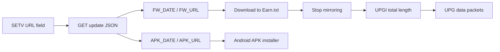

# Qshot firmware and Android app investigation

Static investigation and bounded hardware checks, 2026-09-29. This supplements the historical
[DrongScreen record](REVERSE_ENGINEERING.md) and [claim ledger](VALIDATION.md).
`OBSERVED` below means inspected documentation, bytes, or decompiled code unless
a physical observation is explicitly named. No firmware was executed or flashed.

## Findings that change the next experiment

- **`HARDWARE-VERIFIED`: Qshot V2 non-Pro displays stills and bounded motion over Jetson USB-A.** One
  20-byte SETR received a valid 332-byte SETV frame (316-byte payload), reporting
  product `HC15B100` and version `2511261024`. A later approved checkpoint sent
  one landscape SINF and one 1280x720 H.264 image; the user's photograph confirms
  the selected game scene on the physical screen. A later five-second test sent
  25 independent IDR frames at 5 fps; the user confirmed the counter and moving
  square. Correcting the SINF source-dimension order then produced a square
  block and unstretched numbers. Subsequent tests verified smooth playback for
  30 seconds at 10 fps with independent frames, and five seconds at both 10 and
  30 fps with predictive frames. Live desktop and browser video then worked
  through a 61.7-second timed run, targeting 30 fps and averaging 29.18 fps
  in transmission. Longer runs remain untested.
  The earlier predictive-frame test was reported static; its cause is unresolved.
- **`OBSERVED`: SETV carries an update-metadata URL.** HCCast fetches JSON there,
  then selects `FW_URL` for monitor firmware or `APK_URL` for the Android app.
  Treating the SETV field itself as a firmware download URL is incorrect.
- **`OBSERVED`: HCCast 3.3.0 retains the documented DrongScreen wire format.**
  USB filters, both USB roles, framing, SETV fields, and video flow agree with
  the historical record. The accessory version string differs: `3.7` versus
  `3.700000`. Neither static agreement nor that difference establishes Qshot
  interoperability.
- **`OBSERVED`: the official Pro image was recovered.** Its hash matches the
  previous inspection, and container/uImage integrity checks pass. It targets
  `HC15B100`; compatibility with the user's non-Pro unit remains unknown.
- **`OBSERVED`: the current vendor gateway lists a different Android package.**
  It advertises HCCast `com.hccast.hccast` through version `3.3.3` and routes
  Google Play to HCLink `com.hclink.hclink`; its linked Xiaomi store lists 3.4.2.
  The recovered 3.3.0 APK is
  `com.hccast.application`; it is not established as the newest vendor app.
- **`OBSERVED`: HCLink 1.3.5 extends the same protocol.** Its actual service sends
  one-second PINGs and supports Wi-Fi transport, pause/resume, and firmware uploads
  in 1,024-byte payloads. The final payload contains only remaining file bytes.
- **`OBSERVED`: 7RYMS 0.0.3 contains Qshot support and remote firmware.** Its
  Qshot update UI selects a bundled `125_brc_v1.1.6.ufw` and invokes authenticated
  JieLi Bluetooth OTA. This is a separate protocol from monitor HCCAST updates.

## Device and app map

| Device / function | App or update route | Evidence and confidence |
|---|---|---|
| Qshot V2, Android wired mirroring | HCCast; manual QR names `hccast_3.2.2.apk` | `OBSERVED`, official V2 manual, PDF page 11 / printed page 9; high confidence in the documented association |
| Qshot V2 Pro, Android wired mirroring | Same manual QR destination | `OBSERVED`, official Pro manual, PDF page 13 / printed page 11; high confidence in the documented association |
| Qshot V2 monitor update | Computer, USB copy mode; mirror button from off | `OBSERVED`, V2 manual, PDF page 13 / printed page 11; documented procedure, not exercised |
| Qshot V2 Pro monitor update | Computer, firmware USB port, copy mode; power and mirror together from off | `OBSERVED`, Pro manual, PDF page 14 / printed page 12; documented procedure, not exercised |
| Detachable Qshot remote update | 7RYMS app, device scan and Bluetooth upgrade | `OBSERVED`, both manuals' update pages; separate from monitor firmware |
| HCLink Android mirroring | `com.hclink.hclink`, acquired 1.3.5 | `OBSERVED`, vendor gateway links this package; DEX contains HCCAST USB and Wi-Fi paths, not yet tested on Qshot |
| 7RYMS Android remote updater | `com.commlite.sevenryms`, acquired 0.0.3 | `OBSERVED`, Qshot V2/Pro names, manuals, BLE service and invoked OTA client in the APK |
| RK-X40F-family reference | Historical DrongScreen / HCCAST path | Existing Jetson result is `HARDWARE-VERIFIED` on one unit; see the claim ledger |

Both manual QR codes decoded to
`http://apk.hichiptech.com/apk/hccast_3.2.2.apk`. The Pro firmware separately
contains `http://apk.hichiptech.com/apk/hccast_3.3.0.apk`. The saved photograph
of the user's actual screen did not yield a QR payload; its destination remains
unknown. A manual QR is not a fresh reading of that screen.

Primary manuals: [Qshot V2](https://cn.7ryms.com/download_details/11.html),
[Qshot V2 Pro](https://cn.7ryms.com/download_details/12.html).
The [7RYMS App Store listing](https://apps.apple.com/us/app/7ryms/id6783727282)
also describes Bluetooth firmware updates, but does not identify Android bytes.
The [Android mirror listing](https://apkpure.net/7ryms/com.commlite.sevenryms/download)
provided the analyzed 7RYMS 0.0.3 artifact through its ordinary download flow.

## Acquired artifacts

Downloads and analysis outputs are retained privately with acquisition receipts.
The separate local artifact index records their absolute cache paths. Vendor
binaries, decompiled source, signed CDN URLs, and tool archives are excluded from
the publication candidate.

| Artifact | Identity / size | Provenance |
|---|---|---|
| `HCCast-3.3.0-ziko.apk` | `com.hccast.application`; versionName `3.3.0`; versionCode `20250701`; 9,806,597 bytes | [ZIKO manufacturer's tutorials](https://www.zikoinno.com/tutorials), linked HCCast 3.3.0 APK; secondary manufacturer, not proven byte-identical to the Qshot QR target |
| HCLink XAPK / base APK | `com.hclink.hclink`; versionName `1.3.5`; versionCode `20260905`; 16,987,609 / 16,270,726 bytes | [APKPure HCLink](https://apkpure.net/hclink/com.hclink.hclink/download); base plus 18 resource splits |
| 7RYMS XAPK / base APK | `com.commlite.sevenryms`; versionName `0.0.3`; versionCode `3`; 26,950,420 / 26,522,476 bytes | [APKPure 7RYMS](https://apkpure.net/7ryms/com.commlite.sevenryms/download); base plus three splits |
| Bundled remote firmware | `125_brc_v1.1.6.ufw`; 934,560 bytes | Exact member `assets/7RYMS_V2_File/125_brc_v1.1.6.ufw` in the acquired 7RYMS base APK |
| English Pro ZIP | `qshot_v2_pro_1.2.7 20260604.zip`; 3,153,148 bytes | [7RYMS English firmware page](https://www.7ryms.com/download_details/13.html), listing dated July 6, 2026 |
| Chinese Pro ZIP | Same advertised filename and size | [7RYMS Chinese firmware page](https://cn.7ryms.com/download_details/16.html) |
| Pro firmware member | `Qshot_V2_Pro_1.2.7 20260604.bin`; 3,470,959 bytes | Single member of either ZIP; identical member bytes despite different ZIP hashes |
| Extracted application | `hcscreenhybrid`; 8,259,608 bytes | LZMA payload from the Pro firmware uImage |
| V2 / Pro manuals | April 2, 2026 filenames; 12,689,723 / 15,185,341 bytes | Official manual pages above |

SHA-256 identities:

```text
HCCast APK   46da8f5ad6be0af13378d310f837e4502bfd7bf317d469e9a09052de50a8640c
HCLink XAPK  437fa9e9a782177057e23bd6ed3c7789c0a126f4131356852a829f0680d55a1a
HCLink base  0bbfdd5d74ba6fb41bb35b921187a29c802fa8ae50d940845871abe206de7f80
7RYMS XAPK   5598a070c0e7434b40bd3360e31e6e4d06ea48e96dc7e119f9781c792aed30db
7RYMS base   689985dcc5016f7a9f111c8f7fff15653cd5deaf2ce22f64299f542dadcc1139
Remote UFW   ae80d6f20349ef74ba03fa896a27ecbf6dabdfd35a08e6d7bdd5c33a8547f350
English ZIP  b47abbdd7792eddb3a583f185c14ea7737555ae0c315357025b513549b714d5e
Chinese ZIP  95a0523f437b2551e81ed54998233c18279611fdf689f8129d0c2d65a9b217f2
Firmware BIN 400087033894c889ed87c35b7e6afe9e90a2254f3528d3b1bfb16fe38e418bcf
Application  9d2cf02daba97f9cc7cd9a838415b3b39cd25ad68a6d839bf400cae314d4e91b
V2 manual    e8b688260add77f8da0c4c15530e9b3872e4a7318bbcd7be9caf4bfaba0193a0
Pro manual   4967f037ce691ac82caef4d26379d300e263c9f514775f31879bb9170f1ad7fb
```

`OBSERVED`: the HCCast APK has no `lib/` native-library directory. Its manifest declares
minSDK 21, targetSDK 35, debugging and cleartext traffic enabled. The certificate
in `META-INF/CERT.RSA` has subject `C=US,O=Android,CN=Android Debug` and SHA-256
`24ae6048e3c991a176dd680320a326a381e96b3d0eeca6e8d60e68511bc1402d`.
HCLink declares minSDK 24 / targetSDK 36 and contains two DEX files with no native
libraries. 7RYMS declares minSDK 24 / targetSDK 36; its ARM64 split includes
`libjl_ota_auth.so`. No app or native library was executed.

Android `ApkVerifier` verified all **24 APKs**: HCCast plus both new packages'
bases and splits. HCCast verifies under v1/v2; both new bases verify under v2/v3.
All splits match their respective base signer. Certificate SHA-256 identities:

```text
HCLink 53dee8e9b8704dc205c58162693c92e60b5727ddc5e7ca0a602ec71d16493fd2
7RYMS  8afa90f83430f066796fa767e9ef83b7b063afa63ba172aaae61214c13d951df
```

This verifies the downloaded bytes against their embedded signers. Publisher
identity, signing continuity across HCCast packages, and hardware compatibility
are separate questions; the recovered HCLink and HCCast signers differ.

Historical DrongScreen 3.2.11 remains identified by SHA-256
`614c01b3939aa843af7db1f27424e1a2a754e52a02f3bea2ae1c6778cc6e6f4f`.
Its original APK and decompiler tree were not recovered; comparison here uses the
existing record, not a fresh binary diff.

### Current download limits

`OBSERVED`: requesting the firmware's legacy HCCast 3.3.0 URL returned a 769-byte
HTML download gateway, not an APK. Its public app index, inspected with explicit
user approval, lists HCCast through 3.3.3 and HCLink through 0.0.1. Those are
server metadata values, not acquired versions. The gateway includes a verification
puzzle; no verification token was forged or bypassed.

The linked [HCLink Google Play page](https://play.google.com/store/apps/details?id=com.hclink.hclink)
is published by hichiptech. Its September 4, 2026 release notes mention USB
heartbeat and wireless bitrate/frame-drop changes. HCLink 1.3.5 was subsequently
acquired from APKPure; its DEX findings are below. The current gateway provides
evidence for package migration, without proving signer continuity.

The linked [Xiaomi HCCast page](https://r.app.xiaomi.com/details?id=com.hccast.hccast&ref=search)
lists version 3.4.2, updated September 23, 2026, but disables its web download for maintenance and directs
users to the phone's store. This newer store listing demonstrates that the
gateway's `version_highest` is not a reliable global latest-version claim.
No 3.4.2 APK was downloaded.

Initial direct mirror requests returned HTTP 403; ordinary browser download
flows subsequently yielded HCLink and 7RYMS XAPKs. The official catalogs inspected
exposed a Pro firmware package; no non-Pro monitor package was recovered. This
does not establish that the Pro image is the latest possible build.

## Wired protocol evidence

All following app observations refer to the acquired HCCast 3.3.0 hash above.
JADX 1.5.6 produced usable output with 85 decompilation errors overall. Critical
upload behavior was independently checked against DEX disassembly.

| Question | `OBSERVED` evidence and result |
|---|---|
| Discovery and roles | `UsbCommunication.getUsbDevice/getUsbAccessory` and transport initializers enumerate Android USB objects. Device mode makes Android the host; accessory mode opens the accessory file descriptor with Android as peripheral. |
| IDs and endpoints | `res/xml/device_filter.xml`: `05ac:12ad`, `abcd:0002`. `UsbCommunicationDevice.init` finds bulk IN/OUT dynamically; no fixed endpoint addresses are established by the filter. |
| Accessory identity | `res/xml/accessory_filter.xml`: `ElfCast, Inc.`, `elfcast`, `3.7`. Direct AOA `18d1:2d00` is historical hardware evidence, not this XML filter. |
| Handshake | `DeviceCommunication.onUsbOpened`, `DeviceInfoRequestThread`, `sendRequestInfo`: SETR with four zero payload bytes, retried every three seconds until information is ready. |
| Framing | `MessageUtil.getSendByte`: 16-byte header, BE u32 total length and sequence, four command bytes, BE u32 extension, then payload. SETR extension is 1; other non-media extensions are 0. |
| SETV | `receiveRequestInfo`: minimum total length 320; payload offsets 0/4/8 settings, 12 product (32 bytes), 44 version (BE unsigned u32), 48 JSON URL (256 bytes). Optional settings begin at payload 304/308/312. |
| Video | `DeviceCommunication.start` instantiates `VideoRecorderThreadMultiplicityResetDisplayCodec6`; MediaProjection/VirtualDisplay feeds `video/avc`. Encoder buffers go into VID; checking byte 4 for `0x65` supports Annex-B framing. |
| Transfer boundaries | `UsbCommunicationDevice.send`: splits frames into 16,384-byte writes. Its zero-length-packet condition uses the whole frame length modulo 512 inside the chunk loop. Accessory mode writes the complete frame through its descriptor. |
| Network / BLE | No Bluetooth permission appears in this APK manifest; no device-discovery socket or Bluetooth implementation was found in the inspected `com.hccast` sources. Its HTTP update client is present. This does not characterize the separate HCLink or 7RYMS apps. |

Command bytes, SETS and SINF payloads agree with the
[existing framing specification](REVERSE_ENGINEERING.md#hccast-frame-format).
PING exists in the enum; an active heartbeat loop was not established in this
artifact. The historical 316-byte SETV from the RK-X40F unit is shorter than this
app parser's minimum. Preserve the existing driver's observed shorter variant.

## HCCast 3.3.0 update path



`OBSERVED`, traced through actual UI callers:

1. `UpdateActivity.onLoadPackage` calls `UpdateFw.check`; it reads
   `UsbmirrorManager.getJsonUrl`, populated by SETV through `DeviceBean`.
   `HttpDownloadUtil.get` performs an ordinary GET, prefixing `http://` if the
   field lacks an HTTP(S) scheme. It adds no product/model query of its own.
2. `UpdateBean` defines `FW_VER`, `FW_DATE`, `FW_URL`, `APK_VER`, `APK_DATE`,
   `APK_URL`, and `TEST_MODE`. These are recovered response fields, not a live
   response from the user's monitor endpoint.
3. Firmware availability compares numeric `FW_DATE` with the device version's
   decimal unsigned-u32 string. `FW_VER` is display text. `TEST_MODE == "true"`
   permits the UI offer without a newer version. The client shows the product
   string but no hardware-match validation was found in this path.
4. On user confirmation, `UpdateFw` downloads `FW_URL` to cache filename
   `Earn.txt`. `HttpDownloadUtil.downFile` copies the response body; its callback
   passes HTTP content length, cast to int, to the firmware upload method.
5. `DeviceCommunication.updateFWByFile` stops mirroring, sends UPGI with that
   length as a four-byte BE payload, and sends UPG chunks. UPG magic is
   `00 47 50 55`; UPGI is `49 47 50 55`.
6. Each UPG payload is 16,368 bytes, making a 16,384-byte wire frame. DEX confirms
   that the read count is used only to detect EOF; the last partial buffer is
   sent at full size and may include old or initially zero bytes. Send booleans
   are ignored. Return `true` means the loop reached EOF without its caught
   exception, not that the device accepted or flashed the image.
7. No per-chunk acknowledgement, explicit final-commit exchange, checksum or
   cryptographic signature validation was found along this client path. The UI
   stops mirroring and shows an updating-attention dialog after upload returns.
   Device-side validation and reboot completion remain untraced.
8. Separately, `AboutActivity.onClickCheckVersion` compares `APK_DATE` with the
   Android package versionCode and uses `UpdateApp` / `APK_URL` to invoke APK
   installation. This does not flash the monitor or the Bluetooth remote.

The fixed-buffer behavior is recorded for reconstruction, not copied into a new
updater. No source change to the working wired driver was needed. In particular,
the Pro ZIP/BIN was not demonstrated to be the file expected by any SETV manifest
or the HCCast UPG receiver.

## HCLink 1.3.5: actual service and update paths

`OBSERVED`: JADX produced 3,606 Java files with 81 errors overall. Obfuscated
references below identify this exact APK; upload and heartbeat loops were also
checked against DEX instructions.

| Area | Source evidence and behavior |
|---|---|
| USB and framing | XML filters retain `05ac:12ad`, `abcd:0002`, and accessory `ElfCast, Inc.` / `elfcast` / `3.7`. `v.b`, `v.c` and `v.d` retain the 16-byte BE length/sequence header and command bytes. |
| SETV | `HCLinkService.onCommunicationReceived` constructs `w.d` for SETV. Product/version/metadata URL remain at payload offsets 12/44/48; it reads optional u32 fields through offset 324. The later Qshot response has a 316-byte payload and confirms the base fields and first three optional fields. |
| Heartbeat | USB and network `onConnected` callbacks start `a.a.m()` / `j()`, sending an empty PING each second. Received PINGs update the timestamp. After at least one PING has arrived, a gap over ten seconds disconnects only the `NETWORK` path; the timestamp starts null. |
| Extra commands | `v.d`: LOCK `4b 43 4f 4c`, PAUS `53 55 41 50`, RESM `4d 53 45 52`, INTE `45 54 4e 49`. `v.a` builds LOCK with BE u32 boolean and INTE with empty payload. The service's PAUS/RESM handlers invoke projection pause/resume in `t.b`; receiver behavior for LOCK/INTE remains unverified. |
| Wi-Fi discovery | Service discovery uses `l.a`: multicast group `224.0.0.252`, UDP port 8989. Datagram JSON supplies `device_name`, `service_name`, `service_type`, `service_port`; sender IP comes from the packet. `s.a` also invokes Android Wi-Fi P2P APIs. |
| Network transport | `e.a.a(String, Network)` connects the control TCP socket to peer port 8980 and listens locally for video on 8981 and audio on 8982. `c.a` implements connect/accept; VID/SINF use video, AUD uses audio, remaining commands use control. These are app paths, not measured open ports on Qshot. |

The actual update UI calls `UpgradeActivity.actionStartOnlineUpgrade` or
`actionStartLocalUpgrade`, through `HCLinkService.ServiceBinder.firmwareUpgrade`
and `actionFirmwareUpgrade`, into `v.a.c(a.a, byte[])`:

1. `f.a.q()` fetches JSON from the SETV URL; `g.e` parses the same FW/APK fields
   and `TEST_MODE`. A stored `DEBUG_UPGRADE_ENABLE` / `DEBUG_UPGRADE_URL` can
   override that metadata URL; the override defaults off in `n.a`.
2. Online selection uses `FW_DATE` versus device version, with the test-mode
   override. `f.a.e()` downloads `FW_URL` into a byte array. Local selection uses
   Android's document picker and reads the selected file into a byte array.
3. UPGI carries the byte array's actual length. UPG payloads are at most **1,024
   bytes**, with a precisely sized final payload. A full wire packet is 1,040
   bytes, distinct from the older app's 16,384-byte firmware packets.
4. This loop queues the data without waiting for a per-block acknowledgement or
   adding an explicit final commit. No file signature or model-match validation
   was established in these UI/download/upload methods. Device acceptance and
   firmware-side validation remain unknown.

## 7RYMS 0.0.3: remote firmware over Bluetooth

`OBSERVED`: the base APK includes Qshot V2/Pro names and both manuals.
`MainApplication` names the family `7RYMS Qshot V2`; database code also contains
underscore variants. These are app strings, not captured advertisements.
JADX produced 2,263 Java files with four errors overall.

`MainActivity` copies `7RYMS_V2_File` into private app storage through `f6`.
`OtaUpgradeDetailsActivity.onCreate` chooses that folder for its matching Qshot
name; `f6.c/d` selects the file and derives displayed version `1.1.6` from its
filename. `k1()` sets the firmware path and calls the SDK's `z2()` entry point.
The bundled UFW is therefore tied to an invoked remote-update path. Its internal
container, integrity checks and compatibility with an exact remote revision have
not been established. It must not be substituted for monitor firmware.

| Bluetooth role | UUID / actual caller |
|---|---|
| OTA service | `0000ae00-0000-1000-8000-00805f9b34fb` |
| Write characteristic | `0000ae01-0000-1000-8000-00805f9b34fb`; `fb0.b()` calls `z7.y0()` with this UUID |
| Notification characteristic | `0000ae02-0000-1000-8000-00805f9b34fb`; `z7.onServicesDiscovered` finds it and schedules notification setup, including CCCD `0x2902` |
| SDK receive path | `fb0` forwards BLE notification data into `com.jieli.jl_bt_ota.impl.a.s2()` |

The update UI explicitly sets `k8.s(true)`, whose field is `isUseAuthDevice`;
DEX confirms that configuration. `RcspAuth` provides success/failure callbacks
and loads `libjl_ota_auth.so`. This establishes enabled device authentication,
not cryptographic signing of the UFW file; no authentication bypass was attempted.

The invoked SDK distinguishes device requests and responses. `lc0` maps these
command IDs, and `ek0` plus `com.jieli.jl_bt_ota.impl.a` invoke the update flow:

| ID | Recovered operation |
|---|---|
| `0xe1` | Request the upgrade-file flag's offset/length |
| `0xe2` | Ask whether the device permits OTA, supplying file-flag bytes |
| `0xe3` | Enter update mode; response includes acceptance status |
| `0xe5` | Device requests a block: BE u32 file offset plus BE u16 length (`lt`). Client reads that region and returns data (`nt`). |
| `0xe6` | Query update result |
| `0xe7` | Reboot request |
| `0xe8` | Content-size/progress notification: BE u32 size, optionally another BE u32 progress (`cb0`) |

`J0()` treats an E5 request with offset and length both zero as end of data, replies,
then queries the update result. The success callback requests reboot. This differs
from HCCAST's sequential push loop. BLE capture, native authentication analysis
and device-side file validation remain open.

### Bluetooth command framing

`OBSERVED`: `pe0.l(b7)` serializes the packets sent by the SDK's data handlers;
`pe0.f` and `fk0.c` parse their fields. DEX cross-checks confirm the prefix, flag
bits, end marker and `pa.m` big-endian length conversion.

| Offset | Bytes | Meaning |
|---|---:|---|
| 0 | 3 | Start marker `fe dc ba` |
| 3 | 1 | Flags: bit 7 marks a request; bit 6 requests a response |
| 4 | 1 | Command ID |
| 5 | 2 | Big-endian body length N; complete packet length is N + 8 |
| 7 | N | Request: sequence byte then command parameters. Response: status byte, sequence byte, then response parameters. Command `0x01` adds an extended-command byte before parameters. |
| 7 + N | 1 | End marker `ef` |

This serializer appends no packet checksum or authentication tag. Authentication
has a separate receive path: `s2()` passes data to `RcspAuth.handleAuthData` until
the device is authenticated, then forwards it to the framed-packet handler.
This does not establish the radio link's encryption state.

Synthetic E5 examples, derived from the serializer and **never transmitted**:

```text
Request sequence 0x2a, file offset 0x1000, length 16:
fe dc ba c0 e5 00 07 2a 00 00 10 00 00 10 ef

Success response, sequence 0x2a, illustrative data 00 through 0f:
fe dc ba 00 e5 00 12 00 2a 00 01 02 03 04 05 06 07 08 09 0a 0b 0c 0d 0e 0f ef
```

These examples check field arithmetic and support future capture interpretation;
they are not vendor-app output, device captures, or proof of a working updater.

## Pro firmware structure

`OBSERVED`: the BIN has a 64-byte outer header, followed by an inner header and
seven 32-byte section records. Data begins at file offset `0x440`; section
offsets are relative to that base and cover the remaining file exactly.
CRC32 matches both headers' first words when that word is zeroed over each
header's complete image extent. These integrity checks establish consistent
bytes; they do not establish cryptographic signing.

| Section | Absolute file offset | Bytes | Identified content |
|---|---:|---:|---|
| 0 | `0x440` | 12,288 | `NCRC` marker; role unassigned |
| 1 | `0x3440` | 494,984 | Role unassigned |
| 2 | `0x7c1c8` | 387,312 | `NCRC` marker; table destination agrees with boot partition |
| 3 | `0xdaab8` | 173,056 | ROM1FS, volume `romfs`; H.264 background files and `logo.hc` |
| 4 | `0x104eb8` | 2,401,563 | 64-byte uImage header plus 2,401,499-byte LZMA payload |
| 5 | `0x34f3d3` | 172 | Persistent metadata containing `HC15B100` |
| 6 | `0x34f47f` | 496 | `ddrinfo` marker; role otherwise unassigned |

The uImage declares MIPS, name `hcscreenhybrid`, load and entry address
`0x80001000`, and LZMA compression. Header and compressed-payload CRCs pass.
`INFERRED`: initial instruction words fit little-endian MIPS32; no machine-code
decompilation or function boundary claims depend on that inference in this pass.

`OBSERVED`: the decompressed application includes a device tree at offset
`0x54ed80`, board string `hc1512a@dbB100`, HCRTOS/FreeRTOS references, and an
ST7701S LCD node. Its declared flash layout is:

| Label | Flash offset | Reserved bytes |
|---|---:|---:|
| boot | `0x000000` | `0x065000` |
| eromfs | `0x065000` | `0x090000` |
| firmware | `0x0f5000` | `0x2fb000` |
| persistentmem | `0x3f0000` | `0x010000` |

These ranges total 4 MiB. They describe this image, not a measurement of the
user's non-Pro board. The ROM1FS file inventory includes `background1.264`,
`background2.264`, `background_exit.264`, `background.264`, and `logo.hc`.

### Firmware update and transport leads

Offsets below are in the decompressed application, not the outer BIN or proved
runtime function addresses:

| Offset | `OBSERVED` content | Limit |
|---|---|---|
| `0x57ad58` | HCCast 3.3.0 APK URL | App download lead, not firmware metadata |
| `0x57ad18` | Private-address HCFOTA JSON template | Embedded build/test lead; not contacted |
| `0x57b520`, `0x57b538` | IUM/AUM event callback names | USB-mirroring components; call boundaries not reconstructed |
| `0x57df44` | Board-product mismatch diagnostic | Evidence of a check-related path, not proof all entry points enforce it |
| `0x646560` | CRC-check failure diagnostic | Algorithm/coverage not inferred from the string alone |
| `0x64e3dc`, `0x64e3ec` | `upgrade_submit`, `upgrade_interrupt` | HTTP handler names, not hardware execution evidence |
| `0x67b600` | `f_ium.c` source-path reference | Gadget-function implementation clue |

Embedded web-client code provides two update flows: a JSONP response with
`version` and `url`, or `/network/package_info` with `product`, `version`, `chip`,
and `vendor`, followed by `/network/package_content?file=...`. It forwards the
selected URL to the device's `upgrade_submit?url=...`; file upload uses
`upload_submit`. Sample localhost configuration is bundled too. Active server
configuration, device-side checks, and applicability to a shipping Qshot mode
remain unknown. Miracast/AirPlay/AirP2P strings support separate wireless code
paths; ports, BLE services, and wire compatibility are not established by them.

## Jetson Qshot identification checkpoint — 2026-09-29

`OBSERVED`: after the user confirmed the powered non-Pro Qshot was connected and
approved one bounded identification check, the Jetson exposed the alternate
known identity `1cbe:0005`, interface 0 `ff/06/50`. Saved binary descriptors confirm
bulk OUT `0x02`, bulk IN `0x81`, and 512-byte maximum packets. The initially
searched `05ac:12ad` identity was absent.

The checkpoint stopped before claiming the interface: the device-node read/write
access check returned false, and that node was absent when subsequently checked.
**Zero SETR packets were attempted.** An access check on a disappearing node
does not establish a Unix permission denial. No driver was detached, no privileged
command ran, and no firmware or video operation occurred.

The saved kernel-log interval, 08:58:59–09:02:39 UTC, contains 52 disconnects,
60 new high-speed enumeration attempts, and repeated descriptor/address errors
`-71` on the same port. This cycling predates our attempted probe. The underlying
connection problem remains unidentified; cable, power, USB role and device
behavior have not been isolated. This is fresh Linux descriptor evidence, with
no HCCAST response or display-output claim.

The first check used USB-C and battery power. NVIDIA's
[hardware guide](https://docs.nvidia.com/jetson/orin-nano-devkit/user-guide/latest/hardware_layout.html#usb-ports)
confirms that USB-C supports host/device roles and USB-A is host-only.

The user then added external power, confirmed the screen was on, and retained
the USB-C-to-USB-C cable. `OBSERVED`: a passive 30-second check found none of the
three known monitor USB identities in 61 kernel-state samples. The kernel log
contained no new USB entries during that window. This absence does not establish
a working or stable USB session.

`OBSERVED`: two subsequent kernel-state reads reported the Jetson's USB-C role
as `device`, with NVIDIA's existing `l4t` gadget bound as `0955:7020`. The controller
state was `default`, speed `UNKNOWN`; no FunctionFS mount existed. SSH used Wi-Fi.
The screen had not configured the stock gadget. The earlier role was not measured,
so external power cannot yet be identified as the cause of this role selection.

`INFERRED`: the existing direct Android-accessory path, `18d1:2d00`, is the next
useful identification experiment with this cable. The user authorized this
checkpoint: temporarily unbind `l4t`, create the FunctionFS gadget, wait at most
10 seconds for configuration, and run a 0.5-second handshake with at most one
20-byte SETR. The existing CLI can finish an in-flight read during cleanup; this
is not the strict 500-ms raw collector used by `host-setr-once`. An outer 15-second
deadline plus 5-second termination grace bounds a stalled command. Cleanup must
remove only the new gadget and restore/verify the original `l4t` binding and
identity even if the attempt fails. No gadget change or SETR has occurred yet.

`OBSERVED`: the approved gadget preflight confirmed the same controller, device
role, stock binding and Wi-Fi SSH route, with matching source hashes. `sudo -n`
then returned `sudo: a password is required`. The checkpoint stopped before
unbinding or sending anything. A final read confirmed only stock `l4t` was bound
and no FunctionFS mount existed. A single-use runner is staged privately for the
user to enter the Jetson password in their Terminal. Its restoration paths are
`UNIT-TESTED` for success, attempt failure and cleanup failure; physical restoration
had not yet been exercised at that point.

### Completed authorized gadget attempt

`OBSERVED`: the user ran the staged command after entering the Jetson sudo
password. Between 09:26:45 and 09:26:56 UTC, it created and bound `18d1:2d00`,
registered FunctionFS descriptors, and received `BIND`. It timed out after the
10-second wait without receiving `ENABLE`. The bulk transport and HCCAST session
were therefore never opened: **zero SETR attempts**, no response test, and no
video or firmware operation. The runner's broad `NO_SETV` result is specifically
a USB configuration timeout; it does not mean the screen rejected SETR.

`OBSERVED`: before/after snapshots independently match stock `l4t` identity,
strings, function list, configuration links and UDC binding. The test gadget and
mountpoint were removed, FunctionFS mounts were absent, and SSH stayed on Wi-Fi.
A separate live read confirmed only `l4t` remained bound. Cleanup logged failed
attempts to remove ConfigFS's built-in parent groups, but the enclosing test
gadget was removed and the stock profile was verified. These messages did not
cause the earlier configuration timeout. The targeted kernel-log window had no
USB entries; it adds no explanation of the timeout.

The earlier successful RK-X40F-family reference log shows a USB-C controller
event immediately before `ENABLE`, roughly 113 seconds after initial gadget
binding. `INFERRED`: cable-attach timing is worth controlling in a later experiment;
this does not prove that reconnecting fixes the Qshot. This completed single-use
checkpoint must not be rerun automatically.

`OBSERVED`, official non-Pro V2 manual, PDF page 6 / printed page 4: the side
socket beside the remote-control section is labeled for screen projection,
firmware upgrade and power supply. The separate bottom socket near the 1/4-inch
mount is labeled charging. Confirm the Jetson data cable and external supply use
those respective sockets, and record the current screen UI before proposing the
next bounded connection test. The user's exact Qshot-side sockets were not identified.

### USB-A retry preflight

The user subsequently connected a USB-A cable, removed external power, reported
normal screen startup, and explicitly requested another attempt. `OBSERVED`:
the same `05ac:12ad` device remained present in all 13 half-second samples over
six seconds. It was already configured at USB high speed (480 Mb/s), interface
0 `ff/2a/ff`, with 512-byte bulk OUT `0x01` and IN `0x81`. Saved binary descriptors
support these fields. No kernel driver was bound to the interface.

The device node existed with mode `0664`; the SSH user lacked write access.
This is a concrete permissions obstacle, unlike the
earlier disappearing-node check. The bounded host-side command was attempted
through `sudo -n`, which stopped at `sudo: a password is required` before the CLI
ran. **Zero SETR requests were sent in that preflight.** No gadget, permission, or service setting
was changed. The staged single-use host command then awaited local password entry;
it repeats identity/interface checks, sends at most one 20-byte SETR, collects
for at most 500 ms, and releases the interface. It stops on claim failure and
does not detach drivers or activate a different USB configuration.

`UNIT-TESTED`: the existing host transport and bounded probe suite passed all
70 tests in 0.06 seconds. The staged shell command passed Bash syntax checks on
both machines, and its copied bytes match. These checks do not establish a
Qshot protocol response; the following physical run supplies that evidence.

### Successful USB-A identity exchange

`HARDWARE-VERIFIED`, 2026-09-29 09:47:12 UTC: after local sudo password entry,
the user ran the staged host probe on the powered non-Pro Qshot. It opened
`05ac:12ad` interface 0, sent one 20-byte SETR, and collected one complete
332-byte SETV frame within the 500-ms collection window. The frame has a
16-byte header, sequence 0, flags 1, and a 316-byte payload. The CLI exited 0
with no write, read or parse errors. Local raw-byte parsing independently
confirmed its length, command, field offsets and decoded values.

| Reported field | Value |
|---|---|
| Product | `HC15B100` |
| Version field | `2511261024` (raw unsigned integer, not interpreted as a release date) |
| Mirror type / resolution | `0` / `1` |
| Audio enabled | `0` |
| Vertical mode / auto revolve / full mode | `2` / `1` / `1` |

Raw response SHA-256:
`31748a1562ade46bda42656b3b09f3b3b19fe47966564a2cffb43e9bcbd862ee`.
The process exited and the same USB device address/configuration remained present.
The existing host transport releases its interface in `finally`; no kernel
driver was detached, and no gadget, service or permission configuration changed.

`OBSERVED`: the advertised metadata URL uses an RFC1918 private IPv4 address and
the path `/hccast/rtos/HC15B100/hcscreenhybrid/HCFOTA.json`. Its exact value is
retained in private evidence; the address was not contacted. Substituting the
reported product into the cached Pro firmware's URL template at decompressed
offset `0x57ad18` produces the same string. `INFERRED`: this strengthens the
shared-software finding, but product/template agreement does not establish exact
board revision, firmware interchangeability, reachable update service, or a
successful update. The response establishes HCCAST identification on this
USB-A topology; that identification checkpoint sent no video, audio or firmware commands.

### Successful single-frame display

`HARDWARE-VERIFIED`, 2026-09-29 11:00:48–49 UTC: after explicit approval and
local sudo password entry, the single-use runner sent one SETR, received a valid
332-byte SETV, sent one 36-byte landscape SINF, then sent one 472,632-byte VID.
The VID contains the selected game scene as a 472,616-byte H.264 access unit:
Constrained Baseline, level 3.1, yuv420p, 1280x720. The recorded message hashes
match locally reconstructed SETR/SINF/VID bytes. The response independently parses
as sequence 1, flags 1, with the same product/version and 316-byte SETV payload.

All writes returned successfully; the video write took about 0.124 seconds.
That is application transfer time, not measured screen latency. No STOP arrived
in the one-second observation window; no parser bytes were discarded or left
pending. USB close returned, exit code was 0, and a later read found no runner
process while the same configured USB address remained present.

`OBSERVED`: the user's photograph shows the selected goblin/sorceress scene on
the Qshot in landscape, with both HUD corners and the score/stage visible.
Black bands are visible above and below the scene. Native panel resolution and
pixel mapping were not measured. The photograph supplies the physical confirmation
that the original machine-only result cannot provide. Both are retained privately.

This establishes static-image rendering through the existing host backend on
this Qshot/Jetson pairing. That still alone does not establish motion, sustained
streaming, latency or reconnect behavior. No settings, audio or firmware commands were sent.
The marker remains intact and no repeat was performed during evidence review.

Media SHA-256: `088bbedaebdd5da7473615dd6d926613838b128f801d8bb70af902dc6c7ef63e`.
Raw response SHA-256: `aab9aba9b980bcba1d28a133260031eceefe0a9c1db1adac48c3ade9dc42991a`.

### Motion checkpoint: transfer complete, static display reported

`OBSERVED`, 2026-09-29 11:32:10–16 UTC: the single-use motion runner sent one
SETR, received valid SETV (sequence 2), sent one landscape SINF and 50 VID access
units at 10 fps. Video payload totaled 585,402 bytes over 4.905 seconds. All
52 message writes returned and match locally reconstructed bytes by SHA-256.
The reader received only the 332-byte SETV, with no STOP, discarded bytes or
incomplete response. USB close returned, exit code was 0, and the process was
absent afterward with the same configured USB address present.

The user reported "Static image, no movement" and confirmed no rotation or scale
change. The supplied photograph shows a cropped central part of the color pattern;
the changing counter is outside the visible area. The exact sent clip decodes
locally into 50 distinct frames with no decoder errors. That checkpoint therefore
did not verify physical motion, despite successful application writes.

The successful still used an independent IDR frame with no reference pictures.
The motion clip uses five IDRs and 45 predictive frames, with one reference
picture. Both have baseline profile, level 3.1, 1280x720 dimensions, square pixels
and eleven slices per access unit. These differences motivate a simpler independent
frame check; they do not establish the cause. Cached HCCast 3.3.0 still supports
zero media-header extension values; no evidence justifies changing them here.

### Independent-frame color diagnostic

`OBSERVED`, 2026-09-29 11:46:26–30 UTC: the user ran the three-second color
diagnostic. It sent one SETR, one landscape SINF and 15 independent video frames
at 5 fps over 2.802 seconds. The response was valid SETV (sequence 3), all 17
outgoing-message hashes match reconstructed bytes, no STOP arrived, USB close
returned and the process exited 0. The same configured USB address remained.
The exact copied clip decodes locally to five red frames, five green and five blue.

The user reported multiple visual states. This supports visible image changes;
exact color names are not used as evidence of incorrect rendering. It does not
establish smooth motion, correct cropping or color fidelity, and does not uniquely
isolate predictive-frame handling as the cause of the earlier static observation.
No settings or firmware commands were sent. Original evidence and completed
markers are preserved.

### Independent-frame monochrome motion confirmed

`HARDWARE-VERIFIED`, 2026-09-29 12:03:41–47 UTC: the five-second monochrome
checkpoint sent 25 independent IDR frames at 5 fps over 4.804 seconds. All
27 application-message hashes match the prepared SETR, SINF and VID bytes. The
response is valid SETV sequence 4 with the same product/version. No STOP or
parser residue was recorded; USB close returned, exit was 0, and the process
was absent afterward with the same configured USB address present.

The user confirmed the counter advancing from 00 to 24 and the square moving
as described. Their photo shows the final 24 with the marker at the left.
This verifies bounded motion on this Qshot/Jetson pairing. The still photo
corroborates the final state; motion confirmation comes from the user report.
The graphic appears enlarged and horizontally stretched compared with the
encoded preview, so correct scaling remains unresolved.

The runner retained the same SINF and used one SETR, one SINF and 25 VID messages.
Its software checks passed 106 tests before the physical run. Seven copied
evidence files were hash-verified, and the raw SETV was independently parsed.
Higher frame rates, sustained playback and the earlier predictive-frame static
report remain unresolved; this result does not isolate the earlier cause.
Original evidence and completed markers are preserved.

### Landscape source-dimension mismatch

`OBSERVED`, HCCast 3.3.0: `DisplayUtil.getMirrorAdaptiveConfig()` starts with
short/long source dimensions. `VideoRecorderThreadMultiplicityBase.getDisplayInfo()`
then calls `MirrorBean.exchangeWidthHeight()` for landscape. That method swaps
both `Width/Height` and `RealWidth/RealHeight`. `sendDisplayInfo()` serializes the
result in that order. The selected `VideoRecorderThreadMultiplicityResetDisplayCodec6`
uses this inherited path before configuring the encoder.

The completed Qshot trials supplied `(1, 1280, 720, 720, 1280)`, which leaves the
source pair in portrait order. For the synthetic landscape source, the app path
corresponds to `(1, 1280, 720, 1280, 720)`. The earlier short/long interpretation
missed the second pair's swap. The physical checkpoint below confirmed corrected
proportions when only those source dimensions changed.

`UNIT-TESTED`: a private geometry checkpoint changes only those two SINF words.
It reuses the exact successful 25-frame monochrome clip, 5 fps pacing and bounded
session. The new regression failed against the prior pair; the updated runner
passed 107 relevant checks, including byte-for-byte equality of SETR and all
VID messages. Staged hashes, import and passive descriptors matched on Jetson.
`HARDWARE-VERIFIED`, 2026-09-29 12:22:42–48 UTC: that checkpoint completed
25 frame writes over 4.803 seconds, with SETV sequence 5, exit 0 and USB closed.
All 27 message hashes match reconstructed bytes. SETR and every VID match the
prior run exactly; only SINF differs. The process was absent afterward and the
same USB address remained configured. The user confirmed the five-second
animation, a square white block and numbers without horizontal stretching.
This verifies the dimension-order correction on this Qshot/Jetson pairing.
Original logs and the completed marker are preserved privately.

The CLI now orders source dimensions by orientation before building SINF.
Regression coverage checks both host and gadget commands, either input dimension
order, distinct encoder/source resolutions, portrait behavior and the verified
landscape default. The legacy Python field names remain compatible with callers.
The correction is applied on both Mac and Jetson, with original source backups.
`UNIT-TESTED`: 374 distinct checks passed across the full local run and a targeted
rerun of four sandbox-blocked loopback tests; lint passed. All 13 geometry
regression cases also pass on the Jetson Python 3.10 runtime without USB access.
The subsequent 10 fps result follows; sustained playback remains open.

### Ten-frame-per-second playback confirmed

`UNIT-TESTED`: a five-second 10 fps checkpoint was prepared, retaining the corrected
landscape SINF and independent-frame encoder settings. Its 50 frames contain
counter 00 through 49 and the same square trajectory with smaller steps. All
50 frames decode locally to distinct hashes. The runner permits one SETR, one
SINF and at most 50 VID messages; it retains the three-second notice, 12-second
deadline and two-second termination grace. The current protocol source hash
includes the documented geometry correction. The relevant suite passed 120
checks, and Jetson hashes, import, packet bounds and passive descriptors matched.
`OBSERVED`: the first run completed at 13:55:29 UTC, with 50 frames sent over
4.904 seconds and a clean close. The user requested another viewing.

`HARDWARE-VERIFIED`, 13:59:15–21 UTC: an identical rerun sent 50 frames over
4.903 seconds, totaling 252,448 video payload bytes. All 52 outgoing-message
hashes match the prepared sequence. SETV sequence 7 identifies `HC15B100`,
version `2511261024`; no STOP or parser residue was recorded, USB closed and
the runner exited 0. The user confirmed smooth animation without stops or
catches through completion. This verifies five-second independent-frame
playback at a 10 fps sending rate on this pairing. The observation is a user
report; display cadence was not measured. Rates above 10 fps, sustained
playback and predictive-frame decoding remain unresolved. Original machine
records and the user confirmation are retained separately in private evidence.

### Thirty-second playback confirmed

`UNIT-TESTED`: the 30-second checkpoint repeats the verified five-second clip six
times in one connection at 10 fps. The 300-frame media is byte-identical to six
copies of the original; all frames decode and each cycle's decoded hashes match.
The counter repeats 00 through 49 six times. The runner retains one SETR, one
SINF and the same dimensions and encoding, with a 300-VID limit and a 40-second
deadline plus two-second termination grace. All 122 relevant checks passed,
including timed transmission and the wrapper deadline. Jetson import, hashes,
packet bounds and passive USB descriptors matched.

`HARDWARE-VERIFIED`, completed at 14:18:30 UTC: all 300 frames were sent over
29.903 seconds in one connection, totaling 1,514,688 video payload bytes.
All 302 outgoing-message hashes match the prepared sequence. SETV sequence 8
identifies the same product and version; no STOP or parser residue was recorded,
USB closed and the runner exited 0. The user reported six smooth passes with
no issues. This verifies 30-second independent-frame playback at a 10 fps
sending rate on this pairing. Display cadence was not instrumented. Longer
runs, rates above 10 fps and predictive-frame playback remain unverified.

### Controlled predictive-frame playback confirmed

`UNIT-TESTED`: the controlled five-second test retains the monochrome source,
10 fps sending rate, dimensions, profile, quality setting and bounded session.
The monochrome source was recovered and re-encoded with the original settings;
that control exactly reproduces the hardware-verified independent-frame file.
Changing the keyframe interval produces five IDR frames and 45 P frames, with
one reference frame and no B frames. Keyframes occur at 0, 10, 20, 30 and 40.
All 50 frames decode without errors, and thresholding their black/white pattern
matches the original source pixel for pixel. The clip is 50,575 bytes compared
with 252,448 bytes for the independent-frame baseline.

The runner still permits one SETR, one SINF and 50 VID messages with a
12-second deadline. All 122 relevant checks passed; Jetson file/source hashes,
import, packet bounds and passive descriptors matched.

`HARDWARE-VERIFIED`, completed at 14:47:46 UTC: the run sent all 50 frames over
4.901 seconds, totaling 50,575 video payload bytes. All 52 outgoing-message
hashes match the prepared sequence. SETV sequence 9 identifies the same product
and version; no STOP or parser residue was recorded, USB closed and the runner
exited 0. The user reported smooth playback. This verifies the five-second
predictive-frame configuration at a 10 fps sending rate, with about 80% less
video payload than the independent-frame baseline for the same pattern.
Longer predictive runs remain untested. The initial static report's cause was
not isolated by this successful controlled test. Display cadence was not
instrumented; original machine evidence and the user report remain separate.

### Thirty-frame-per-second playback confirmed

`UNIT-TESTED`: at the user's request, a five-second 30 fps test was staged before
live desktop work. Its 150 frames contain five IDR frames and 145 P frames,
with one reference frame, no B frames and one keyframe per second. The corrected
1280x720 landscape dimensions, baseline profile and quality setting are retained.
The square follows the same trajectory in finer steps. Counter 00 through 49
holds each number for three frames; every third source frame matches the verified
10 fps source exactly. All 150 frames decode without errors, and their thresholded
black/white patterns match the new source pixel for pixel (146 distinct patterns).
The encoded file is 65,526 bytes.

All 122 relevant checks passed, including timed transmission, identity rejection,
write-failure cleanup and the 150-frame bound. Jetson import, file/source hashes,
message bounds and passive descriptors matched. The single-use runner retains
one SETR, one SINF, a three-second notice and a 12-second deadline plus two-second
termination grace. The sending pace is explicitly 30 fps; raw-stream probe rate
fields do not measure display cadence.

`HARDWARE-VERIFIED`, completed at 15:17:03 UTC: all 150 frames were sent over
4.967 seconds, totaling 65,526 video payload bytes. All 152 outgoing-message
hashes match the prepared sequence. SETV sequence 10 identifies the same product
and version; no STOP or parser residue was recorded, USB closed and the runner
exited 0. The user reported smooth playback. This verifies the five-second
predictive configuration at a 30 fps sending rate on this Qshot/Jetson pairing.
Display cadence was not instrumented, and longer predictive runs remain
untested. Original machine evidence and the user report are preserved separately.

### Live desktop and video playback confirmed

`IMPLEMENTED`: the user approved a one-minute 1280x720 desktop session at a
30 fps sending rate, showing a live clock and a looping public sample video.
The private checkpoint uses existing Xvfb, Openbox, Chromium and GStreamer
software encoding, then the verified USB-A host session. It permits one SETR,
the corrected SINF and at most 1,800 VID messages. Reads return available pipe
data immediately to avoid waiting for the parser's full read-buffer size.
The USB worker has a 70-second deadline; the desktop wrapper has a 95-second
deadline plus 15 seconds for cleanup. Browser/source processes run unprivileged.

`OBSERVED`, software source check: 450 captured desktop frames encoded in
15.079 seconds as 15 I frames and 435 P frames at 1280x720, baseline level 3.1,
with no B frames. All frames decode without errors. Browser observations record
281 decoded video frames and zero dropped frames; an extracted capture frame
shows the browser, clock, counter and playing video. Source processes closed,
the temporary X socket disappeared, and no browser process from that run remained.
The initial readiness query timed out; the corrected wait and successful capture
are preserved as separate attempts. These checks did not open USB.

The sample is the [flower video in MDN's video-element example](https://developer.mozilla.org/en-US/docs/Web/HTML/Reference/Elements/video).
Its direct MP4 URL returned HTTP 200 from the Jetson.

`OBSERVED`, completed at 15:45:17 UTC: the live run sent all 1,800 frames over
61.676 seconds, averaging 29.18 fps against the 30 fps target. Video payload was
27,789,590 bytes; all 1,802 outgoing-message hashes match the recorded video and
framing. SETV sequence 11 identifies the same product and version. No STOP or
parser residue was recorded; USB closed, exit was 0, and the source processes
and temporary X socket were gone. The browser reported 1,650 decoded video frames,
zero dropped frames and no playback errors. All 1,800 transmitted frames decode
without errors; the video region continues changing through the final frame.

`HARDWARE-VERIFIED`: after initially reporting a frozen screen, the user clarified,
"No, it was fine before it stopped." Playback worked through the timed run; the
held final image followed the planned stop. The final decoded source image shows
counter 61 and clock 08:45:17. This verifies bounded live desktop and video playback
on this Qshot/Jetson pair. Outgoing write-start gaps had a 33.459 ms median,
68.271 ms 99th percentile and 131.551 ms maximum. These are sender observations,
not measurements of physical display cadence. Longer runs and end-to-end latency
remain unverified. Original machine evidence and both user reports are preserved
separately.

### Reusable launcher prepared

`IMPLEMENTED` and `UNIT-TESTED`: the next private runner adds Start, Stop and
Ctrl+C to the verified one-minute live setup. Each launch gets a separate evidence
directory; an inherited process lock rejects overlapping launches. A normal timed
or manual stop sends 60 independent frames of a high-contrast "Session ended"
card in the existing connection, then releases USB and closes source processes.
Encoder, identity, transport and cleanup failures remain failures; they cannot
report a successful stop. The byte bound stays 64 MiB, and the maximum video count
is 1,800 live frames plus 60 ending frames. The USB worker has a 75-second timeout
and three-second termination grace; the outer launcher has a 100-second timeout
and 15-second cleanup grace.

All 164 relevant software checks pass, including 16 new lifecycle/protocol cases.
Appending the prepared ending card to the recorded live video decodes all 1,860
frames without errors. The card is 1280x720 constrained-baseline H.264, level 3.1,
and its decoded preview was inspected. Staged file hashes match on the Jetson;
its existing Python 3.10.12 passes offline launcher checks and reports stopped.
The previous completed checkpoint remains intact.

`HARDWARE-VERIFIED`, completed at 20:11:24 UTC: the reusable launcher sent 1,800
live frames over 61.613 seconds (29.21 fps average transmission), followed by
60 copies of the prepared ending-card frame. All 1,862 outgoing message hashes
match independently reconstructed framing and video. The saved response parses
as SETV sequence 13, same product/version, with no STOP or parser residue.
All 1,860 transmitted frames decode without errors, and the final 60 match the
prepared card exactly. USB closed, exit was 0, all source processes stopped and
the temporary X socket was removed. The browser reported zero dropped frames.
The user reported: "It completed, and it looks good. Let's move on." This confirms
the timed playback and ending card on this pairing. Manual Stop/Ctrl+C and
repeated launcher sessions remain unverified. Original machine records retain
their pending physical-confirmation field; the separate user report supplies
physical confirmation.


Mac browser control is now `IMPLEMENTED` and `UNIT-TESTED` through the private
launcher's `--control` mode. It reuses installed x11vnc/noVNC, binds only Jetson
loopback ports 5907 and 6087, and reaches the Mac through SSH forwarding. This mode
has a five-minute target, at most 9,000 live frames plus 60 ending frames, and a
320 MiB payload limit; the original one-minute mode is unchanged. `OBSERVED` in
a desktop-only check: Mac keyboard events reached the isolated desktop, YouTube
search loaded visibly, 1,800 source frames encoded in 60.102 seconds and decoded
without errors, and preview processes/ports closed. No USB or sudo was used.
All 168 relevant software checks passed. The combined five-minute Mac-control
and Qshot session is now `HARDWARE-VERIFIED`: it completed at 20:32:43 UTC,
sending 9,000 live frames over 306.586 seconds (29.36 fps average transmission),
followed by 60 ending-card frames. The user reported completion with no issues.
All 9,062 outgoing hashes were independently verified; SETV sequence 14 identifies
the same product/version. All 9,060 frames decode without errors. USB closed,
exit was 0, source processes stopped, and the preview ports and X socket closed.
Manual Stop/Ctrl+C and sessions longer than this remain unverified. YouTube
playback details were not separately confirmed; the landing-page video metric
does not measure playback after navigating away. Original machine records and
the separate user confirmation are retained privately.

## Verification and smallest next steps

Completed locally: ZIP integrity; firmware hash comparison with the historical
record; outer/inner/uImage CRCs; LZMA extraction; ROM1FS and device-tree parsing;
manual QR decoding; APK identity extraction and 24 APK signature verifications;
targeted JADX analysis; DEX cross-checks of both HCCAST upload loops, HCLink
heartbeat, and 7RYMS authentication configuration. Java 21 and JADX were installed only in the
private tools cache with explicit approval. Ghidra was unnecessary for these
container and DEX questions and was not installed.

Documentation checks: `uv run --no-sync python -B -m pytest -p no:cacheprovider -o addopts= -q tests/test_public_repository.py`
reported **13 passed in 0.02s** using the existing offline environment. Local
before/after diffs, relative links and 34 artifact-file sizes/hashes were checked. No
production source changed during that static-analysis pass; the later CLI
geometry correction is recorded above. These checks do not exercise the hardware updater.

The native Claude workflow was inspected, but its CLI reported logged out.
No subscription-authenticated Gemini CLI was verified. Neither worker was
launched, and no paid API was substituted.

1. **Remaining static input:** HCCast `com.hccast.hccast` 3.4.2 is listed but its
   APK is still unavailable here. The acquired HCLink and 7RYMS packages now
   cover the previously missing heartbeat, network and Bluetooth update paths.
2. **Single-frame checkpoint complete:** the private runner and relevant existing
   tests passed (105 tests), the physical run exited 0, and the user's photograph
   confirms the image. The subsequent motion runner passed 114 software checks
   and completed transfer but was reported static. The subsequent 25-frame
   monochrome test is hardware-verified for visible motion at 5 fps. A controlled
   follow-up can keep that central pattern while changing one encoding or rate
   parameter at a time. Landscape proportions are now hardware-verified;
   playback through 30 seconds at 10 fps and five-second predictive playback
   at 30 fps are also hardware-verified. The subsequent live desktop/video run
   worked for 61.7 seconds at a 30 fps target (29.18 fps average transmission).
   A later Mac-controlled session completed 306.6 seconds without issues. Longer
   runs, rates above 30 fps, latency and reconnect behavior remain open.
3. The device's product/version/metadata URL are now known. Continue static
   comparison from the saved bytes; do not probe the private-address endpoint as
   a public vendor service. Firmware compatibility still needs exact board and
   hardware evidence; the current Pro package does not supply it.

`OBSERVED`: SSH access to the existing Jetson project and its Python 3.10.12
environment was verified. PyUSB and the driver are installed. At that checkpoint
the probe, CLI and protocol source hashes matched the Mac; the USB transport differed only in a
missing-dependency error message. `UNIT-TESTED`: local probe/USB transport tests,
`uv run --no-sync python -B -m pytest -p no:cacheprovider -o addopts= -q tests/test_setr_probe.py tests/test_host_usb.py`,
reported **70 passed in 0.06s**. The subsequent descriptor checkpoint and its
pre-transfer stop are recorded above; those software tests do not prove hardware
interoperability.

At the September 29 checkpoint, Raspberry Pi reproduction remained parked.
Later device-specific Pi results are recorded in [TESTED_HARDWARE.md](TESTED_HARDWARE.md);
this historical checkpoint does not supersede them.
